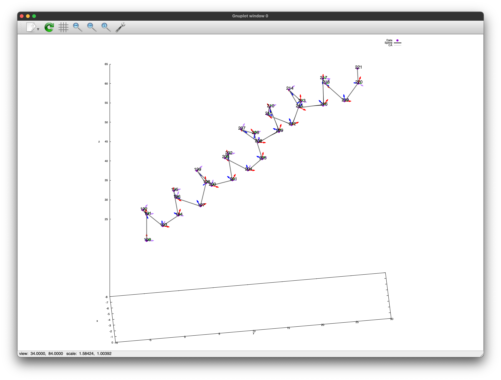
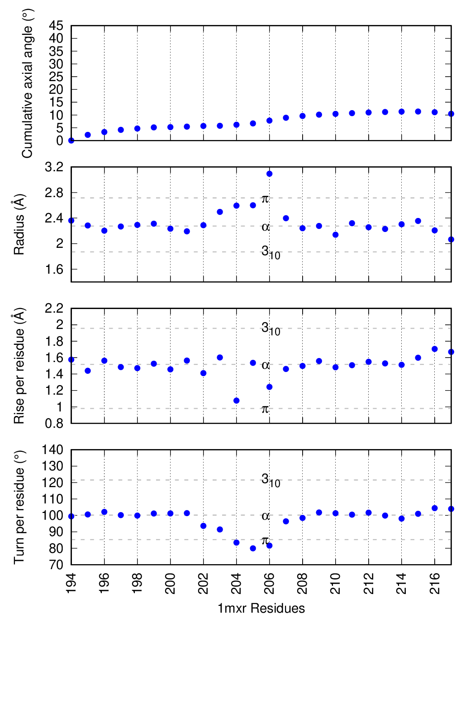

## Install the package

```
pip install git+https://github.com/carbonscott/helix.git --upgrade --user
```


## Install `lmfit` -- the minimizer

```
pip install git+https://github.com/lmfit/lmfit-py.git --upgrade --user
```


## Characterize a helix using Frenet (TNB) frame

- [Construct TNB frame](https://www.integreat.ca/NOTES/CALC/14.06.html)
- [Derive radius](https://link.springer.com/10.1007/s00214-009-0639-4)
- [B-spline curve using scipy](https://docs.scipy.org/doc/scipy/reference/generated/scipy.interpolate.splprep.html)

### Visualization of a Frenet (TNB) frame on a helix

The spline curve fitting gives rise to model points that are really close to the
original data if no stricter smoothing condition is required.  Because we assume
there is no noise in PDB coordinates (although it depends what problems you are
interested in).  




### Helical properties derived from differential geometry under Frenet (TNB) frame




## Parameterize a helix

A helix is parameterized as `h(t) = [x(t), y(t), z(t)]` with a parameter `t`, in which
`t` is a bounded integer.  So a derivative like `dx/dt` can be achieved using
`np.gradient(x)`.  

### Why it's different from using derivatives of a spline?

A cubic spline only renders the appearance of a helix, and thereby the
derivative of the spline curve at any point is not equivalent to the derivative
of `h(t)`, which is fundamental not a smooth function.  

### How does `np.gradient` work?

```
np.gradient(x)
```

is similar to

```
dt = 1
(x[2:] - x[:-2]) / (2 * dt)
```

except for the value on the boundary.  
