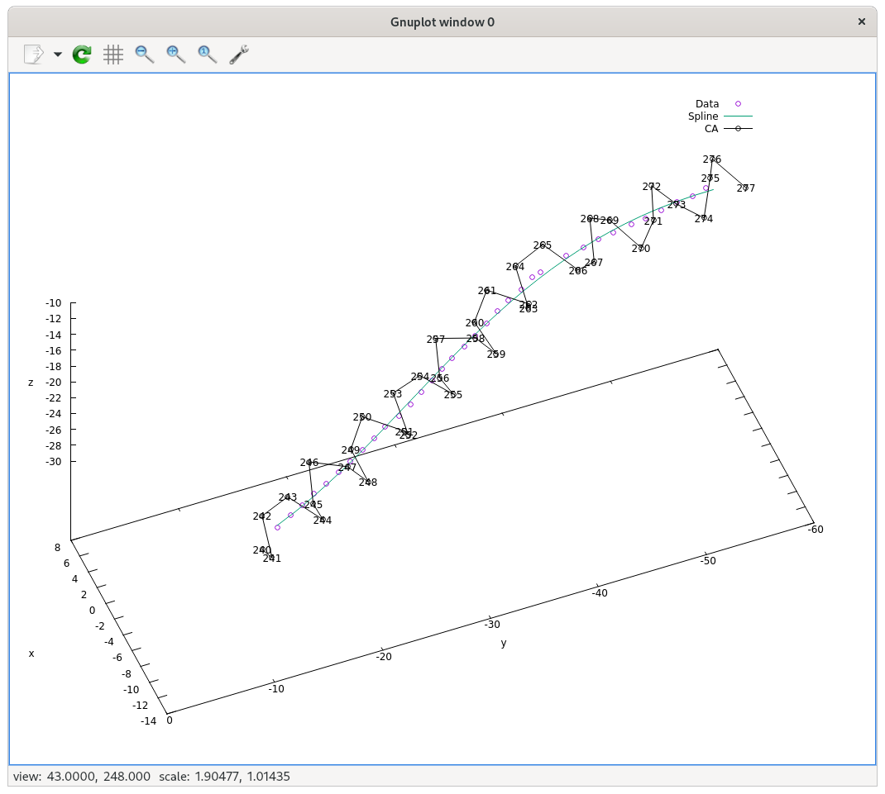

## Install the package

```
pip install git+https://github.com/carbonscott/helix.git --upgrade --user
```


## Install `lmfit` -- the minimizer

```
pip install git+https://github.com/lmfit/lmfit-py.git --upgrade --user
```

## Demo image (Fit a helix to data)


